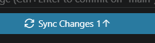

# Model

Het staat model voor digitale tuintjes welke bij 'Het web is voor iedereen' door studenten worden gemaakt.

## Learning Log

### 7 sept - [ les]

- in de les tekst gelezen over wat een digital garden is

zelf heb ik "A brief history en ethos of the digital garden" gelezen

het ging over 6 basis principes van de digital garden

1 typografie en tyme lines,
wat gaat over dat de publishing dates niet uitmaken en je alles kan doen wat en wanneer je wilt

2 continues growth '
het is altijd in beweging en houd je niet tegen om wat dingen te proberen en forceerd je niet om het gelijk goed te doen '
'
3 imperfection en learning in public
het is puur voor je zelf en hoeft niemand ergens van te overtuigen waardoor het eerlijk word
en mensen zien je progressie waardoor het persoonlijker is dan als je tegen een expert praat

4 playful personal experimental
het is puur van jou en je kan er mee doen wat je wilt, zolang je experimenteerd met html css heb je alle vrijheid die je wilt

5 intercropping and content diversity
de content is van audio to film tot blogs tot boeken tijdschriften van alles waardoor het divers en persoonlijk is

6 independend ownership
het is echt van jou in tegenstelling tot dingen zoals insta

wat wilt de schrijver van mij en wat is een digital garden?

waar komen we samen op uit:
de datum waarop je het post maakt niet uit, het is altijd in beweging, het hoeft niet goed te zijn, het is persoonlijk, je kan het aanpassen het is echt van jou en doet ermee wat jij wilt.

erna websites gerieviewed
websites : prin.lu en church basement.org
niet beste sites maar laat wel zien wat mijn site wel moet hebben

### 6 sept - [learning log bijgewerkt]

### 4 sept - [deep dive html/css en schetsen]

in de html/css basis les veel geleerd over wat voor dingen je wel en niet moet gebruiken zoals divs en spans en basis opgefrist.

ook achter gekomen dat java script het liefst zo min mogelijk gebruikt word dus dat ik een manier moet vinden om de mario dino game in css te maken.

als vragen had ik in de les wat atom was en of we dat moesten gebruiken aangezien we al vs codium gebruiken en atom dan overbodig leek. en dat klopte, atom is gewoon een ander programma wat je mag gebruiken als je wilt.

foto aantekeningen css in file 

schets les was ook leuk eerst oude schetsen geranked en gekeken naar wat een schets goed maakt, duidelijkheid, annotaties, lettertype schaduw en nog wat andere dingen. erna moesten we een site na schetsen wat ik wel een hele opdracht vond en wel goed was gelukt en leerden we hoe we een animatie konden laten zien in de schets door blauwe stippel lijnen. 

eind van de dag heeft laura mij nog geholpen om het digitale tuintje goed werkend te krijgen en nu zou alles het moeten doen

### 3 sept - [ziek thuis]

wel geprobeerd thuis powerpoint te volgen van nicky, begreep het allemaal wel goed want was vooral herhaling van experimenteren met interactie.

- toen idee van mario game geprobeerd begin uit te werken door toen thuis nog een youtube tutorial te volgen over hoe je de chrome dino game moet maken, en zelf wat dingen aangepast om het richting mijn idee van mario te veranderen. https://www.youtube.com/watch?v=lgck-txzp9o 

- idee: miss iets met pokemon turn based battle ofzo maken als site

### 2 sept - [ziek thuis inplaats van workshop]

ziek thuis, maar probeer thuis verder te komen, denk dat ik vscodium heb gekoppeld aan site maar denk dat ik iets fout heb gedaan want veranderingen worden niet door gevoerd.

aangezien er 2 versies moeten (bijv licht en dark) denk ik wellicht 1 normale modus en een manga style zwart wit modus

### 1 sept - [thuis]

idee: site over mijn creatieve inspiraties/intresses maken zodat ik veel dingen die ik cool vind kan combineren in mijn site

- mythologie
- anime/manga
- games (retro)
- spiderverse style
- japan. oude tempels maar ook nieuwe cyberpunk style

### 31 aug - Kickoff

Een fork van de model repository gemaakt en gepubliceerd via mijn eigen Github omgeving.

Leg uit wat een source hosting platform is en voor welke jij gekozen hebt.

een programma die websites host, github want die stond al geinstalleerd.

Vertel welke domeinnaam jij gekozen hebt en hoe je die hebt gekoppeld aan jouw pagina.

sebbb mijn naam met extra letters, gekoppeld volgens stappeplan.

Beschrijf hoe je aanpassingen aan jouw pagina kunt maken en hoe je er voor zorgt dat die op het web gepubliceerd worden.

weet ik niet is nog niet gelukt.
