# Model

Het staat model voor digitale tuintjes welke bij 'Het web is voor iedereen' door studenten worden gemaakt.

## Learning Log

### 23 sept - [ les ]

eerst gastspreker wat wel leuk was, erna les waarin we schetsen van dark patterns moesten maken en onze ideeen voor info afstaan moesten schetsen.

Checkout

    Wat is een wireflow en wat heb je er aan?

-gekeken naar dark patterns en wat je moet proberen te voorkomen
Wat zijn dark UX patterns? Geef drie voorbeelden...
-false urgentie, doen alsof iets haast heeft, price comparison, dingen vergelijken, hidden cost, iets duurder maken door iets extra's toe te voegen waar je eerst nog niet vanaf weet.
Waar moet je als ontwerper rekening mee houden bij het maken van een human consent component?
-om het zo eerlijk mogelijk te houden,de gebruiker goed te informeren maar niet weg te schrikken

### 22 sept - [deepdive]

meer geleerd over buttons en hoe ik de img een glow moet geven als hover

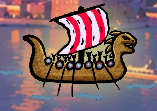
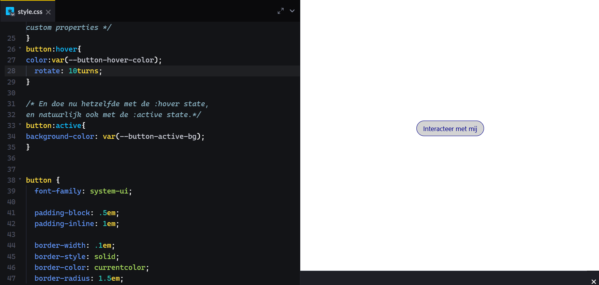
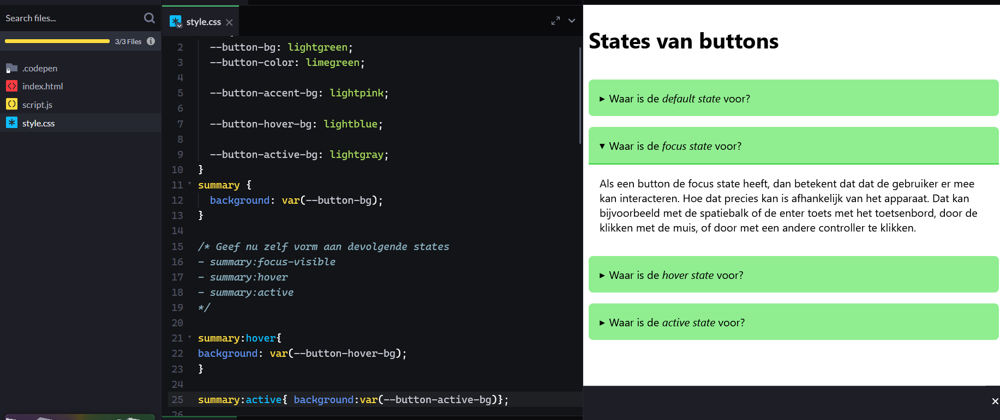

had ook nog een vraag over hoe ik het met tab kan bedienen want bij mij gaan de buttons dat linksboven staan maar daar had vasilis geen tijd meer voor

### 21 sept - [ les]

eerst uitleg van justus toen opdracht over cookie popup 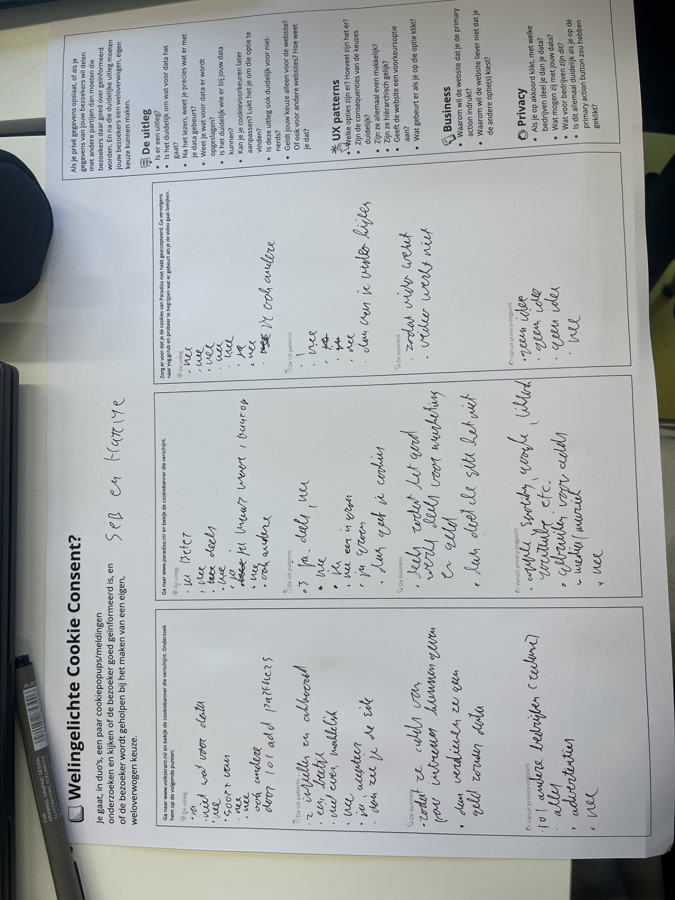

Checkout

    Wat zijn HTML landmark role elements?

-elementen zoals nav waardoor een screen reader de site beter begrijpt

     Wat zijn heading elementen en hoe horen deze 'genest' te worden?

-de goede h1 h2 elementen geven aan verschillende teksten en geen h2 overslaan om h3 te gebruiken bijvoorbeeld

    Hoe ga jij met cookies om? Beschrijf jouw beweegredenen en of die zijn veranderd na het volgen van dit college.

-ik weigerde ze altijd al maar ik let er nu nog meer op

### 20 sept - [checkout maken zodat ik er de tijd voor heb]

Checkout:
Vragen en termen

Oriënteren en begrijpen

    Waarom geven de docenten deze opdracht?

-zodat je op een leuke manier html en css leert te gebruiken/schrijven

    Welke technieken gebruik ik?

-he leert html en css te gebruiken voor de inhoud en opmaak van je site, zoals hoe je in css kan animeren, hoe je linkjes gebruikt, hoe je popovers maakt, hoe je een light dark mode maakt, hoe je items op de goed plek krijgt, en je het op meerdere devices kan gebruiken

    Wat zijn de randvoorwaarden?

-ik weet niet of het aan privacyvoorwaarde en de wet voeldoet maar daar hebben we ook weinig uitleg over gekregen voor de rest zou ik het als webby beschouwen, het is niet de meest toegankelijke site maar dat draagt bij aan de ervaring dat je moet zoeken en steeds iets nieuws ontdekt in te site

    Waar gebruik je HTML/CSS voor?

-alles wat je met html/css kan doen doe je met html css, als het niet met html css kan doe je het met javascript

    Wat kan er allemaal met CSS?

-ik heb deze eerste 2 weken heel veel met css gedaan omdat mijn site heel veel opmaak nodig heeft meet je kan alles op precies de plek zetten waar je wilt, animaties toepassen en effecten met kleuren toevoegen, animaties zijn mijn favoriet.

Verbeelden en conceptualiseren

    Lukt het om verschillende ideeën te bedenken?

-ja het lukt redelijk, ik had in het begin al een redelijk specifieke richting maar het lukte nogsteeds om te zoeken naar de mogelijkheden binnen die visie.

    Lukt het om je ideeën te schetsen?

-ja ik vond het schetsen wel leuk en tijdens de telefoon schetsen ben ik op mijn uiteindelijke idee gekomen

    Wat doet deze CSS-property?

-ik begrijp de vraag niet helemaal maar de animaties in css waren heel leuk om te ontdekken en mee te spelen, en de properties met light en dark mode aan kunnen pasen is ook cool.

    Welke content, en welke HTML heb ik nodig?

-html eigenlijk alleen gebruikt om foto's tpe te voegen, pop overs te maken, tekst in de pop over te schrijven, linkjes en geluid toe te voegen

    Hoe kan ik dit soort content vormgeven?

-ik probeer het in twee stijlen vorm te geven maar ik probeer vooral om het een andere site dan de meeste te laten zijn met een hele andere vormgeving

    Wat als ik hier nu eens 1000 invul?

-wel grappig idee, ik heb wel een ying yang het halve scherm laten innemen hopelijk telt dat.

Prototypen en uitwerken

    Begrijpen bezoekers de site?

-het is niet de duidelijkste site maar ze komen er gaandeweg wel achter hoe die werkt als ze uit nieuwschierigheid op dingen gaan tikken

    Wat vindt de opdrachtgever er van?

-als de opdrachtgever de docent is vond hij het cool. er moest alleen nog iets van een bilb oard als verduidelijking dus die heb ik toegevoegd

    Werkt dit wel?

-eerst dacht ik van niet, toe kwam ik erachter dat het wel mogelijk is het is alleen heel veel werk en veel uitproberen dus het heeft vooral veel tijd gekost

    Oooooh, kan dit óók?!

-dit had ik denk ik toen sanne calc in css gebruikte want op die manier kon ik het goed stylen terwijl het met het scherm mee bewoog

Evalueren
Reflecteren met the riddle:
(1) wat wilde ik weten?
ik wilde een switch maken waarmee je de stad van kleur naar zwart wit kon veranderen

    (2) wat deed ik om er achter te komen?

hetv proberen te maken

    (3) wat was het resultaat?

het werkt deels

    (4) wat weet ik nu (niet)?

dat je met die switch de echte licht dark mode een soort van voor de gek houdt en het niet helemaal goed werkt

    Wat wil(de) ik weten/bereiken?

-ik wilde een coole stad maken met interactieve elementen gewoon omdat het mij cool leek

    Wat heb ik gedaan?

-onderzoek gedaan, geschetst, dingen uitgeprobeerd met code, ging eigenlijk allemaal wel prima en zelfs als ik er niet zoveel aan had heb ik er wel van geleerd zoals hoe je een grid maakt (heb ik in mijn site niks mee gedaan)

    Wat was het resultaat?

-dat je elke keer weer nieuwe ideeen krijgt en het eerste idee nooit vaststaat en je je concept dan weer kan aanpassen want het is jou tuintje.

    Wat weet je nu (niet)?

-dat css soms heel ingewikkeld kan zijn vooral als je een trigger voor light/dark switch wilt maken en dat niet alles op de site even goed werkt, en ik wil leren hoe ik de kleur component koppel aan de custom light dark switch ik heb er wel van geleerd van hoe je de normale light dark functies aan past en hoe je animaties maakt

    Wat vond je (niet) leuk?

-normaal vind ik code schrijven niet heel erg leuk maar in dit geval van dat je je eigen site mag maken op de manier hoe je zelf wilt vond ik het wel heel leuk omdat ik alles mocht doen met visuele beelden en animaties inplaats van saaie text blokken

    Voldoet het nog aan de eisen?

-tijdens het gesprek met sanne kwam ik erachter dat ik een klein beetje was afgeweken van de eisen doordat ik compnenten was vergeten(nu wel toegevoegd), het niet duidelijk was waar je naar keek(nu wel opgelost), en er geen gestalt theorie inzat mar lastig op te lossen is met mijn ontwerp, ik heb wel een schaduw van een persoon wat lijkt op een schim/gestalte maar ik weet niet of dat tever gezocht is en telt.

    HTML validatie

-ik denk dat mijn html nog wel valide is?

    Toegankelijkheids-check

-schreenreader check zal ik nog even doen en alt texten ook checken

    Is mijn website nog wel adaptief?

-ja is wel adaptief en past zich aan naar scherm grootes het enige probleem is dat de background image op telefoon niet inlaad en ik niet weet waardoor

    Voldoet mijn website nog wel aan de wet?

-ik hoop dat mijn website zich aan de wet voldoet, maar ik weet het niet zeker door de gebruikte afbeeldingen

    Zie ik mezelf nog wel terug in wat ik doe?

-jaa dat zeker ik vind het tot nu toe heel leuk om zelf aan je eigen site te werken

de stad nu:
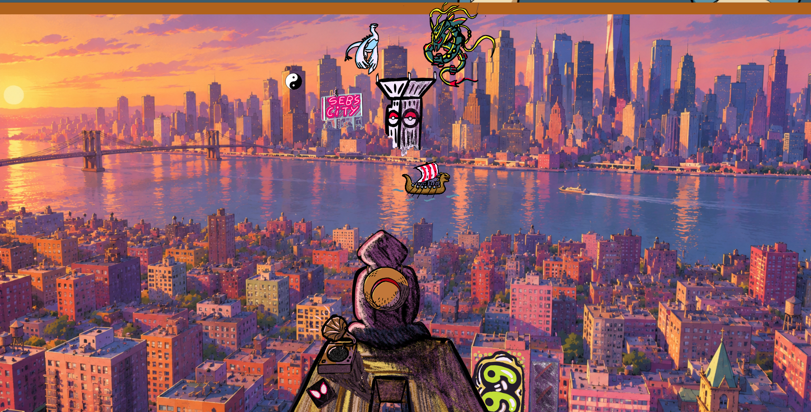
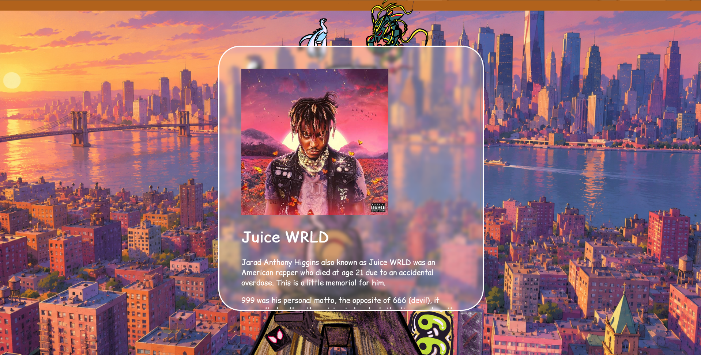
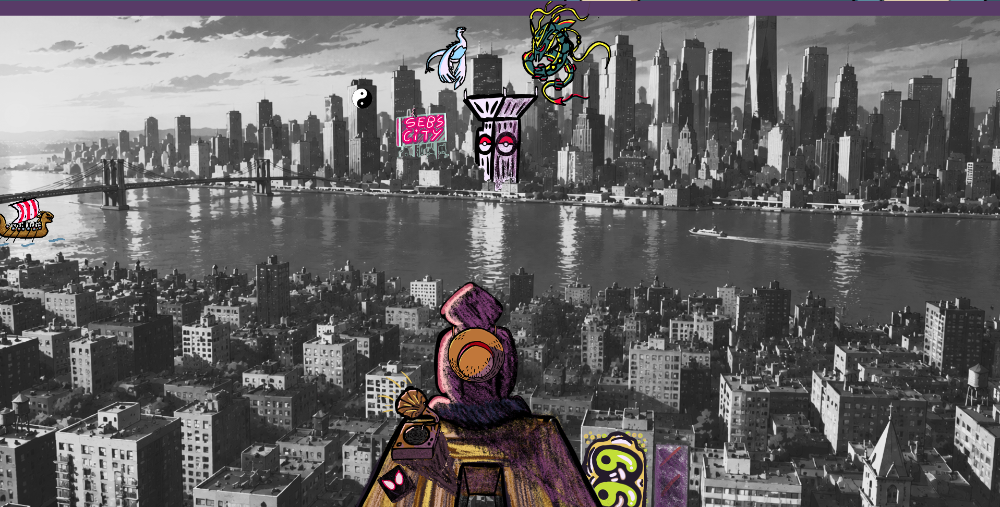
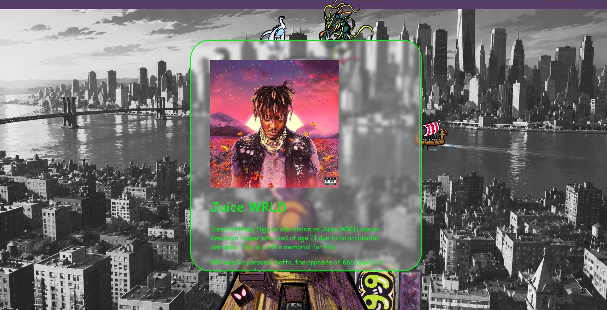

ohja de rand bovenin is gewoon om de componenten te laten zien en haal ik later weer weg want ik wil gewoon de voledige img hebben

### 19 sept - [feedback verwerken]

na feedback een billboard toegevoegd waarop staat "sebs city" en heb ik componenten met kleur voor de tekst toegevoegd

componenten toegevoegd (was ik vergeten)
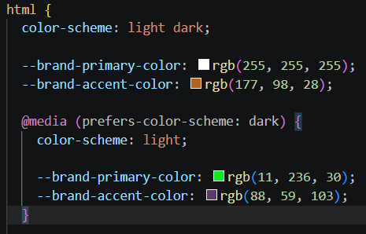

bilboard toegevoegd waardoor je weet waar je naar kijkt

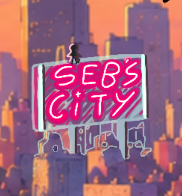

(heb er een gestalte op toegevoegd in de hoop dat dat dan iets van gestalt theorie toevoegd, want de rest van de theorie zoals balans valt lastig toe te passen op mijn ontwerp, denk ik maar ik zal het op school nog even vragen want in mijn beoordeling heb ik er overheen gelezen en staat er niks ingevult)

### 18 sept - [ terug kijken op afgelopen weken]

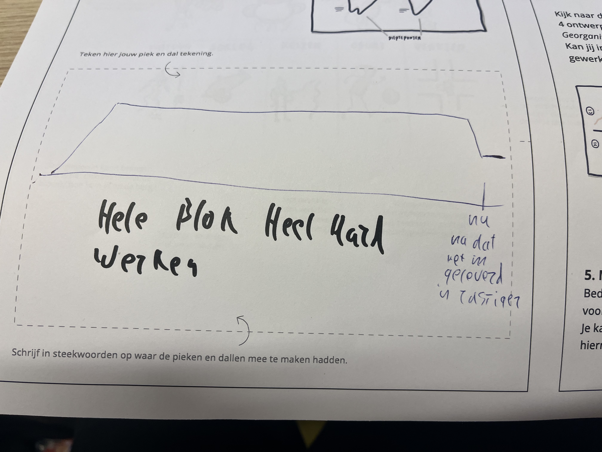
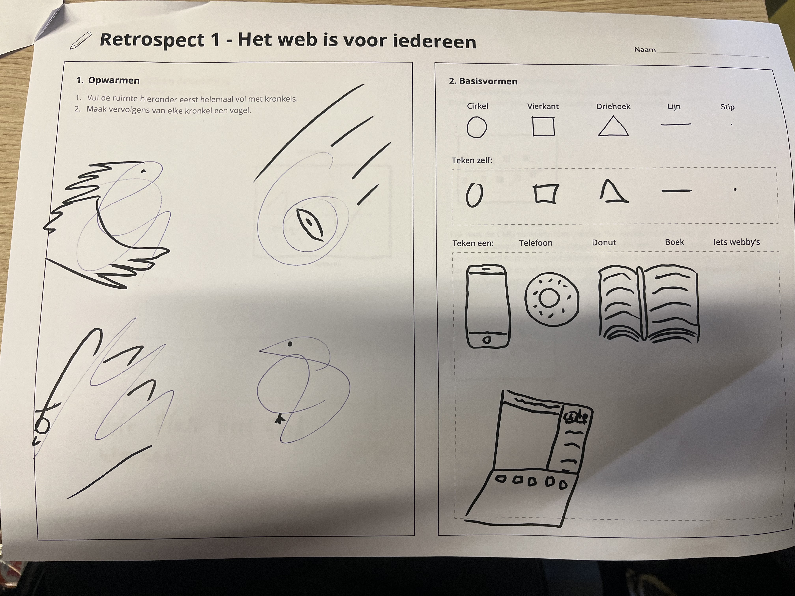
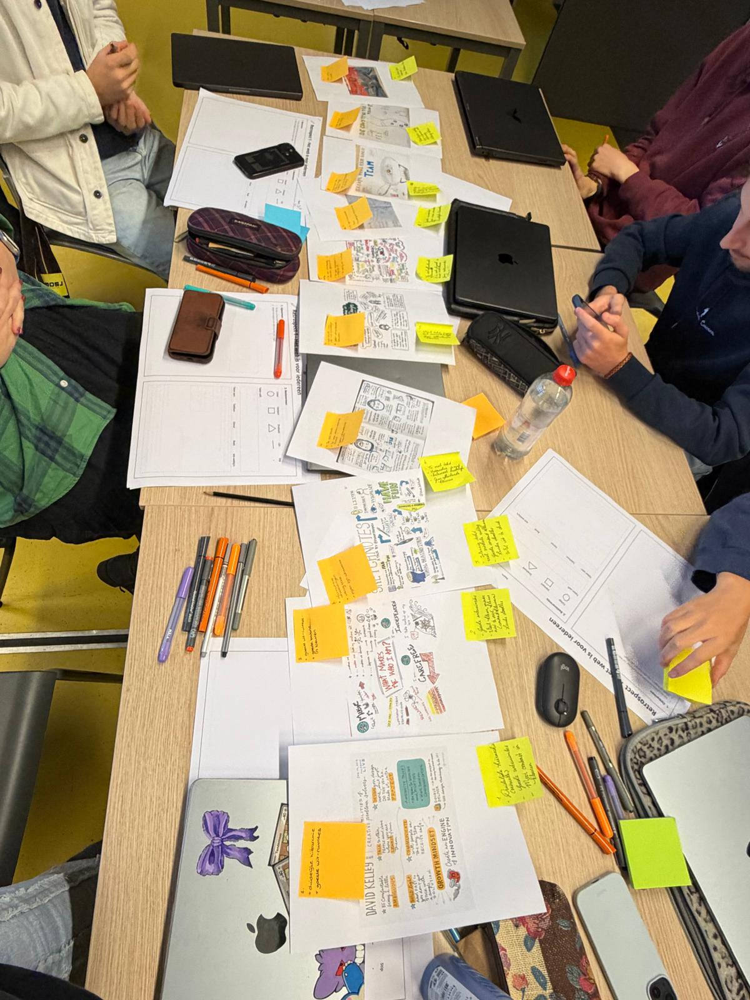
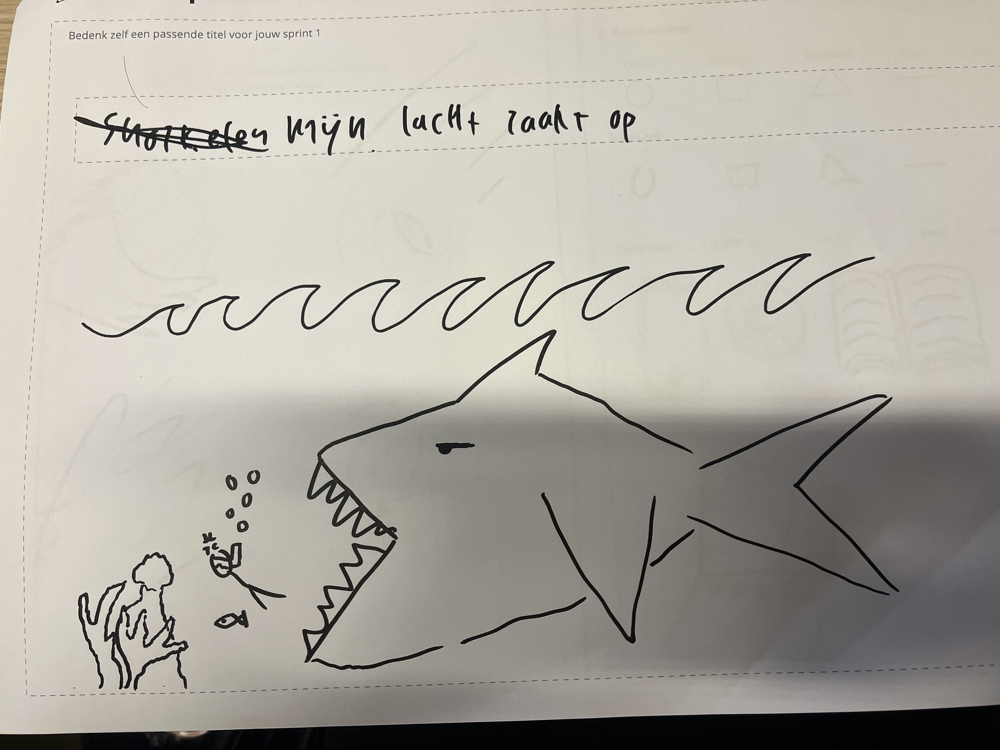

gesprek sanne:
miste nog iets waar ik uitleg wat je ziet zoals sebs intresses ofzo

miste nog componenten ookal kwam ik er later achter dat ikk wel een component had van het vikingschip voor de animatie

ook is de gestalt principes niet ingevult wat ik begrijp omdat mijn site niet echt gestalt principes gebruikt maar het is in mijn site ook wel lastig om dat toe te passen ookal is er wel na gedacht over matchende kleuren

verder vond hij en de hulp student het een mooie site

### 17 sept - [ font aangepast]

had eerst een google font zoals in b lok 2 jaar 1 maar kwam erachter dat het met font face moet dus nu via font face font maken

fonts van google teruggezet en toch maar gewoon comic font gebruikt omdat ik die het best vond passen van de font faces (voor hoever ik weet heb ik niet heel veel font faces kunnen vinden online)

(heb de css en fonts enzo ook gewoon in style gelaten, dat was waar die in de basis van justus stond dus denk dat dat prima is toch? zo niet zal ik gewoon een mapje css maken en hem daar in zetten maar zag daar de toegevoegde waarde niet echt van in)

### 16 sept - [op school]

vandaag hebben we uitleg van diederik gekregen over gestalt principes en over symetrie en andere dingen, erna hebben we voor elkaar geschetst en elkaar geholpen om op ideeen te komen over hoe je dingen zou kunnen displayen. 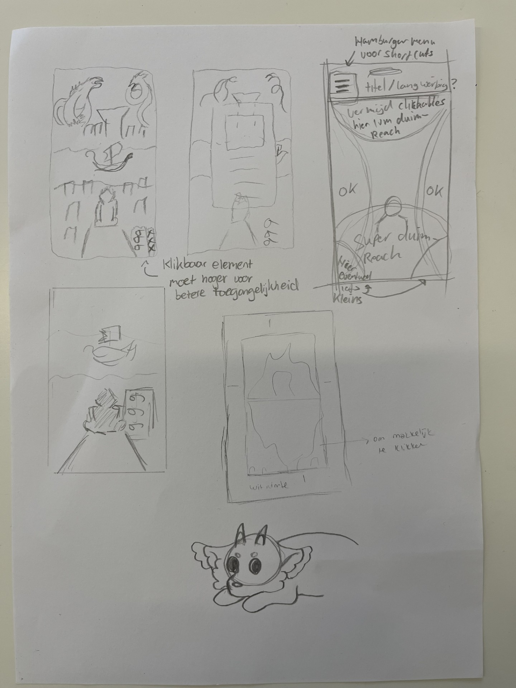

erna kregen tijd om even te werken aan onze site en waren er latere jaars studenten en sanne en diederik er bij om ons te helpen als dingen niet lukte. met sanne gekeken naar hoe je de light dark mode aan en uit zet met een toggle (hij was hier eigenlijk tegen) na veel geklooi lukte het na de uitleg niet helemaal om het werken te krijgen (ook niet met de hulp van hogere jaars student) dus toen weer naar sanne gegaan en de oplossing was om de link te refreshen en om de image te veranderen moest je het als background image doen dus dat is nu gelukt, een andere vraag waar hij mij ook mee heelft geholpen is hoe je geluid toevoegd wat je aan en uit kan toggelen er was wel javascript voor nodig maar dat was eigenlijk redelijk simpel, erna heb ik zelf ook nog een nieuw geteknde afbeelding toegevoegd en dus de light dark switch gecustomized dat het geen lelijke knop is, voor de rest ga ik nu de readme bijwerken van de dingen die ik erin ben vergeten te zetten en de lijst doorlopen om te checken of ik aan alle eisen voldoe.

Check-out

    Noem 3 Gestalt- of Design principes op en laat de ander uitleggen wat ze betekenen en doen.

3 design principes:

symetrie: maakt het rustig maar hoeft niet saai te zijn met die vershillende soorten symetrie, zie nu dat dat balans heet.

vorm/restvorm: dat door lijnen dichtbij elkaar zetten je vormen creeert en mensen er dingen in gaan kunnen zien/herkennen.

ingevulde hiaat: dat je door restvormen/silhouttes/gestalt het dingen intressanter maakt omdat het het belangrijkste uitlicht.

    Een grid biedt ruimte om te spelen (vrijheid), maar tegelijkertijd ook eenheid en structuur (vastigheid). Wat wordt hiermee bedoeld?

een grid zorgt ervoor dat je rond kan spelen in het grid maar doordat het allemaal gebasseerd is op het zelfde grid/lijnen is er ook altijd nog iets van structuur aanwezig

    Welk principe neem je mee in een laatste iteratie van je eigen Garden?

heel misschien neem ik een grid mee in mijn popover maar doordat mijn idee best wel specifiek iis gaat een grid daar niet echt lekker mee helpen

light dark met sanne gedaan, ik ben er wel achter gekomen dat nu na deze verandering op telefoon de achtergrond weggaat maar heb dat nog niet zelf weten te fixen, sinds de light dark mode ook de letterkleur niet meer kunnen veranderen dus ga dat ook nog even aan sanne moeten vragen hoe dat komt.

### 15 sept - [thuis popovers met images en tekst toe gevoegd]

thuis gekeken naar hoe je popovers moet toevoegen en hoe je die er dan in stijlt en eigenlijk de hele dag mee geklooid.

### 14 sept - [op school geholpen met vragen tijdens de les en onderzoeks methodes behandeld]

eerst vragen gekregen daar extra vragen op bedenken en bedenken met welke onderzoekt methode je op die vragen kan antwoorden.

toen naar lokaal en geholpen met wat vragen:

- zwarte balk boven de image hoe krijg ik dat weg?
  met casper wat dingen geprobeerd en uiteindelijk met top 0% gefixt
- images waren veel te groot en namen hele scherm in dus overal ging naar een link behalve op sommige momenten.
  met isabeau gekeken naar hoe dat kan en image was heel groot en blockte link van andere image.  
  ook canvas in procreate kleiner gemaakt en opnieuw geexporteerd waardoor niet alles meer een link is en de vraag is opgelost, maar daardoor nieuwe vraag:
- hoe krijg ik images op de goede plek en vooral dat het responsive is?
  zelf met procenten geprobeerd maar schoof nogsteeds nu met calc responsive gemaakt
- met de bewegende animatie moest het op een andere manier dus met sanne gekeken naar hoe dat moet, vervolgens ook op alle andere frames toegepast zodat hij helemaal responsive is.
- hoe moet je images apart stijlen zonder classes, id, h1 h2?
  door nth of type te gebruiken

  Check-out

  Leg uit wanneer een website 'lelijk' wordt en geef voorbeelden wat je kan doen om deze 'lelijke' onderdelen te fixen?

als er geen overeenkomst is tussen de stijling

    Vertel welke volgende stap je neemt om je website responsive te maken.

de dark mode accesible te maken door een switch toe te voegen en te zorgen dat de afbeeldingen niet verplaatsen

    Kun je het ontwerp en de bouw van je eigen Garden (zo uit je hoofd) onderbouwen in Webby vocabulair?

ik heb gekozen om te focussen op een expresieve garden met de verassing door er kleine dingen zoals muziek toe te voegen ook probeer ik het responsive te maken door het goed mee te laten bewegen (met mediaquireies < 40em) als de grote van het beeld verandert, ik weet niet hoe volwassen het is aangezien er afbeeldingen van het web zijn gepakt en ik niet weet wat daar wettelijk de regels over zijn. ik heb het idee dat ik er een mis maar weet ze niet uit mijn hoofd

### 13 sept - [ thuis verder met procreate animatie vvoor site]

vandaag heel veel geanimeerd, en in html css gegooid en het daar weer verder geanimeerd, ook andere afbeeldingen toegevoegd met links naar sites allees neemt de link nu de hele pagina in beslag omdat is width 100vw heb gebruikt maar weet niet hoe ik hem op een andere maniet op de goede plek krijg, ook heb ik h1 h2 voor afbeeldingen gebruikt dus moet even vra=gen hoe ik dat anders moet opschrijven want dit lijkt mij n iet goed

### 11 sept - [ les en deepdive]

Nieuw idee

Niet spiderman of ronin die daar zit maar gewoon ik, je ziet interactieve dingen dus die pokemon batlle of een manga tijdschrift naast mij en in de bergen nnoorse runes en kleine hints naar dingen die ik cool vind bijv arasaka cyberpunk toren in stad (kan interactief hoeft niet) of in bergen 9tails of itachi silhouet ofzo spiderman masket kan uit rigzak hangen ofzo of naruto hokage cape aan wasrek of luffy hoed ergens, 999 juice wrld ergen (wellicht in graffiti) r2d2

Scan knop dat er groenig filter overheen gaat en easter eggs gele omlijning krijgen zodat je ze goed kan vinden en als je er op tikt uitleg

gekeken naar werk en nieuwe concept doorgevoerd, met sanne gekeken naar animaties en uitleg over gekregen en ga daar nu wel veel mee kunnen.

begonnen met animatie in procreate en ga dat nu kunnen koppelien met css

in deepdive gekeken naar hoe grid werkt, oefening 1 met de tekst vakken was goed te doen maar de oefening met de fis had ik wel moeite mee. wel veel geleerd van hoe een grid werkt van de uitleg van Sanne.

    Checkout

    De checkout van vandaag bestaat uit een vraag:

    Welke feedback heb je gehad?

niet heel specifiek feedback gehad van sanne, hij heeft vooral uitgelegd hoe je kleur transparant maakt en hoe je een animatie maakt omdat ik dat wilde weten. hij was benieuwd hoe mijn site zou worden.

### 10 sept - [ weinig tijd door werk]

5 telefoon schetsen maken ging eigenlijk best goed want tijdens het telefoon schetsen heb ik een nieuwe manier bedacht om het te displayen, fotos:   nummer 5 is op dit moment mijn favoriet/hoofd idee.

als uitleg op nr5 je ziet spiderman over de stad kijken naar de pokemon battle, of je ziet een ronin uitkijken over de battle, als je op spiderman of de ronin klikt krijg je dialog opties en als je op de battle klikt switch het beeld naar de batttle en kan je battelen

ook bezig geweest met de deep dive over kleur  jammer genoeg vandaag door werk niet zoveel tijd als ik wil met het onderzoeken van wat mogelijk is met gradients animeren.

### 9 sept - [ presentatie ]

presentatie ging heel goed heel blij met hoe de presentatie er uiteindelijk uitziet, 8 spetember tot laat aan gewerkt maar uiteindelijk wel met een goed resultaat. ook de collage is goed gelukt 

    Wat is voor jou de essentie van wat je hebt gepresenteerd qua onderwerp en geschreven/beeldende content?

Wat er met de digitale wereld gebeurd als je kleur weghaalt

mijn doel is niet om te bepalen welke beter is, ik wil gewoon een orginele interactieve website maken en onderzoeken hoe kleur en zwart wit de zelfde digitale ervaring anders kunnen laten aanvoelen. ​

    Welke woorden uit de kwaliteitenlijst kunnen passen bij je onderwerp?​

chill, relaxt, iets op een andere manier bekijken, creatief, kleurrijk, rebels

    Heeft 'de ander' een aanvulling op je onderwerp?​

niet echt ze vond het een leuk idee en was benieuwd hoe het zou worden

    Wat is het karakter/ de uitstraling/ het gevoel dat bij het onderwerp past? (bijv. stoer, hip, vrolijk, dynamisch, eenvoudig, enz.)​

een filmische uitstraling, een street vibe, los/dynamisch/vrij, rebels, tegengesteld.

    Welke inspiratie kun je uit je 25 afbeeldingen halen. Stijl, een gevoel, vorm, enz.​

een street vibe, een warm chill gevoel, rust in chaos, oud/traditioneel stijl, futurustische stijl, ronde dynamische vormen of extreme hoekige vormen/tekens door de manga

​

Een stip op de horizon​

    Wat zou je willen vertellen over het onderwerp aan een ander? en hoe zou je dat voor je kunnen zien? middels welke beeld, tekst, animatie, inhoudelijke content? (bijv. Ik wil voornamelijk afbeeldingen tonen, als een soort Pinterest, of ik wil muziek fragmenten laten horen, of ik gebruik korte teksten met eigen foto's). ​

ik wil vooral focussen op beeld, ondersteund door passend geluid. het liefst maak ik het ook interactief

    Vul deze zin aan:

Ik wil mijn Digital Garden laten gaan over.... kleur/zwart wit en hoe je een sprong door de tijd maakt met kleur nieuw en zwartwit oud/traditioneel

en wil dat laten zien door …………………………….een ying yang te maken wat een schakelaar is waarmee je alle content aanpast.
Ik begin met een stukje eigen content over …………………….…een pokemon battle die hopelijk interactief is. ​
Als het begin is gemaakt kan ik mijn Garden verder uitbreiden door …....een scroll funtie te maken waarmee je over een stad beweegt of over bergen beweegd (afhankelijk van mode) waarin je dan ook andere dingen kan bezoeken zoals een mediterende ronin of een spiderman die door de stad slingert.

Check-out

    Leg uit waar het Visual Research in 3 stappen naartoe werkt

eerst heb je de directe vertaling dus wat je zelf op het oog hebt en waar je wat mee wilt doen

dan de abstracte vertaling, tussen posters kijken wat niet precies is wat je zoekt maar waarin je zoekt naar elementen die je aanspreken

en dan als 3e schets maak je schetsen van de ideeen die je hebt opgedaan

ik denk wel dat ik er wat aan heb gehad maar heb nog niet echt een concreet idee maar ik moet waarschijnlijk de info van vandaag laten bezinken en dan kijken wat mij aanspreekt voor de website.

    Vertel in 2 zinnen waar jouw Garden over gaat, en met welke content je dat gaat doen (beeld, tekst, sound, animatie enz).

mijn garden gaat over het verschil tussen een zwart witte digitale wereld en een gekleurde wereld dat ga ik doen door middel van beeld en hopelijk muziek als ondersteuning.
Vertel kort welk idee van de Crazy 8 je het liefst zou willen uitvoeren/ verder zou willen onderzoeken
het idee van de bergen en de stad die switchen lijkt mij het coolst maar ook moeilijk in css

vandaag ook in miro gewerkt wat ik wel een leuke manier van leskrijgen vond
hier is mijn miro board https://miro.com/app/board/uXjVHpsXBFw=/?moveToWidget=3458764683000762968&cot=14

### 8 sept - [ presentatie voorbereiden en light dark mode les]

eerst les van vassilis, heeft mij heel erg geholpen met het uitleggen wat er allemaal mogelijk is met light en dark mode en valideert mijn idee dus dat is heel fijn, ook heeft hij mij geholpen met hoe je de presentatie opend want dat lukte eerst maar niet maar moest blijkbaar in browser tekst aanpassen, hebben voor de rest ook geleerd hoe je light en dark mode kan aanmaken en ook geleerd dat je images er ook responsive naar kan maken. 

word bestand aangemaakt met allemaal plaatjes en links en bedenken wat ik precies wil doen, ik dacht wel aan een zwart wit modus maar kon voor de rest niet echt een goed onderwerp/overlappend idee vinden, ik heb uiteindelijk bedacht om het mario idee te laten vallen en voledig te focussen op de zwart wit modus aangezien dat is wat veel van de intresses gemeen hebben dus wil ik laten zien hoe de online wereld in zwart wit verandert en wat je kan doen om het aantrekkelijk te houden.

onderwerpen:

- spiderverse + spider noir, zwart wit
- pokemon begon ooit in zwart wit en heeft een black and white game
- ghost of tsushima heeft een kurosawa mode waarin je de game in zwart wit speelt als in een jaren 50 samurai modus van de director kurosawa
- god of war krijgt na dat je de game 1 keer hebt uitgespeeld een new game+ modus waarin je de game nog een keer in zwart wit kan spelen voor een andere look
- anime is in kleur en manga is in zwart wit
- jing en jang als symbool om naar zwart wit modus te switchen
- waterverf japanse zwart witte bergen met rode maan

nu bezig met presentatie html uitvinden

met heel veel geklooi uiteindelijk gelukt om afbeeldingen er in te krijgen en om ze goed te centreren, ik weet niet of het op de goede manier gebeurd is maar is denk ik ok.

### 7 sept - [ les]

- in de les tekst gelezen over wat een digital garden is

zelf heb ik "A brief history en ethos of the digital garden" gelezen

het ging over 6 basis principes van de digital garden

1 typografie en tyme lines,
wat gaat over dat de publishing dates niet uitmaken en je alles kan doen wat en wanneer je wilt

2 continues growth '
het is altijd in beweging en houd je niet tegen om wat dingen te proberen en forceerd je niet om het gelijk goed te doen '
'
3 imperfection en learning in public
het is puur voor je zelf en hoeft niemand ergens van te overtuigen waardoor het eerlijk word
en mensen zien je progressie waardoor het persoonlijker is dan als je tegen een expert praat

4 playful personal experimental
het is puur van jou en je kan er mee doen wat je wilt, zolang je experimenteerd met html css heb je alle vrijheid die je wilt

5 intercropping and content diversity
de content is van audio to film tot blogs tot boeken tijdschriften van alles waardoor het divers en persoonlijk is

6 independend ownership
het is echt van jou in tegenstelling tot dingen zoals insta

wat wilt de schrijver van mij en wat is een digital garden?

waar komen we samen op uit:
de datum waarop je het post maakt niet uit, het is altijd in beweging, het hoeft niet goed te zijn, het is persoonlijk, je kan het aanpassen het is echt van jou en doet ermee wat jij wilt.

- erna websites gerieviewed
  websites : prin.lu en church basement.org
  niet beste sites maar laat wel zien wat mijn site wel moet hebben

beste site d00k.net

slechste site vit.baisa.cz

    Check-out
    Leg uit wat een digital garden is en waarom dat anders is dan een reguliere website.

de datum waarop je het post maakt niet uit, het is altijd in beweging, het hoeft niet goed te zijn, het is persoonlijk, je kan het aanpassen het is echt van jou en doet ermee wat jij wilt.

    Leg uit wat een website 'webby' maakt en welke websites jou het meeste inspireren.

sixey.es een site die casper bezocht en was heel gepersonaliseerd met leuke interactie dus die inspireerd mij het meest.

wat een site webby maakt is fluide, interactie,toegankelijkheid, volwassen, expressie en verrassing.

    Vertel waar jij mee aan de slag wilt gaan bij het maken van jouw eigen digital garden (let op: dit zijn jouw eerste ideeën, dit kan en mag veranderen in de loop van het programma.)

een site maken met dingen die ik cool vind

hoofd idee: een site maken met verschillende games zoals mario en pokemon, een animatie toevoegen en met de light en dark mode alles in een zwart witte manga stijl kan veranderen

andere intresses voor de site maar nog zonder concreet idee:

- mythologie (grieks en noors)
- anime/manga
- games (retro)
- spiderverse style
- japan. oude tempels maar ook nieuwe cyberpunk style
- gitaar spiderpunk style

en aangezien mijn site sebbb heet misschien iets doen met bbb inplaats van AAA wat gebruikt word om goede kwaliteit games aan te geven

### 6 sept - [learning log bijgewerkt]

### 4 sept - [deep dive html/css en schetsen]

in de html/css basis les veel geleerd over wat voor dingen je wel en niet moet gebruiken zoals divs en spans en basis opgefrist.

ook achter gekomen dat java script het liefst zo min mogelijk gebruikt word dus dat ik een manier moet vinden om de mario dino game in css te maken.

als vragen had ik in de les wat atom was en of we dat moesten gebruiken aangezien we al vs codium gebruiken en atom dan overbodig leek. en dat klopte, atom is gewoon een ander programma wat je mag gebruiken als je wilt.

foto aantekeningen css in file 
schets les was ook leuk eerst oude schetsen geranked en gekeken naar wat een schets goed maakt, duidelijkheid, annotaties, lettertype schaduw en nog wat andere dingen. erna moesten we een site na schetsen wat ik wel een hele opdracht vond en wel goed was gelukt en leerden we hoe we een animatie konden laten zien in de schets door blauwe stippel lijnen. 

eind van de dag heeft laura mij nog geholpen om het digitale tuintje goed werkend te krijgen en nu zou alles het moeten doen

### 3 sept - [ziek thuis]

wel geprobeerd thuis powerpoint te volgen van nicky, begreep het allemaal wel goed want was vooral herhaling van experimenteren met interactie.

- toen idee van mario game geprobeerd begin uit te werken door toen thuis nog een youtube tutorial te volgen over hoe je de chrome dino game moet maken, en zelf wat dingen aangepast om het richting mijn idee van mario te veranderen. https://www.youtube.com/watch?v=lgck-txzp9o 

- idee: miss iets met pokemon turn based battle ofzo maken als site

### 2 sept - [ziek thuis inplaats van workshop]

ziek thuis, maar probeer thuis verder te komen, denk dat ik vscodium heb gekoppeld aan site maar denk dat ik iets fout heb gedaan want veranderingen worden niet door gevoerd.

aangezien er 2 versies moeten (bijv licht en dark) denk ik wellicht 1 normale modus en een manga style zwart wit modus

### 1 sept - [thuis]

idee: site over mijn creatieve inspiraties/intresses maken zodat ik veel dingen die ik cool vind kan combineren in mijn site

- mythologie
- anime/manga
- games (retro)
- spiderverse style
- japan. oude tempels maar ook nieuwe cyberpunk style

### 31 aug - Kickoff

Een fork van de model repository gemaakt en gepubliceerd via mijn eigen Github omgeving.

Leg uit wat een source hosting platform is en voor welke jij gekozen hebt.

een programma die websites host, github want die stond al geinstalleerd.

Vertel welke domeinnaam jij gekozen hebt en hoe je die hebt gekoppeld aan jouw pagina.

sebbb mijn naam met extra letters, gekoppeld volgens stappeplan.

Beschrijf hoe je aanpassingen aan jouw pagina kunt maken en hoe je er voor zorgt dat die op het web gepubliceerd worden.

weet ik niet is nog niet gelukt.
