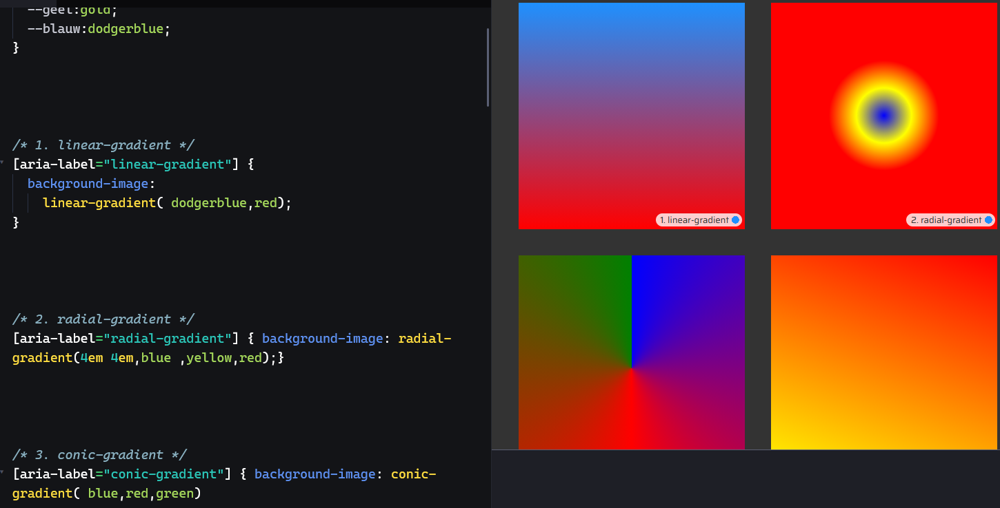
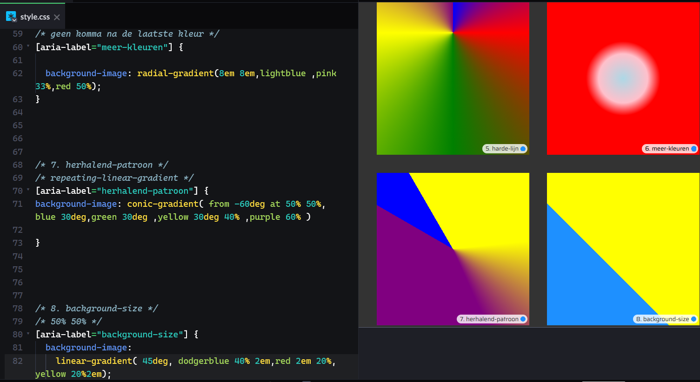
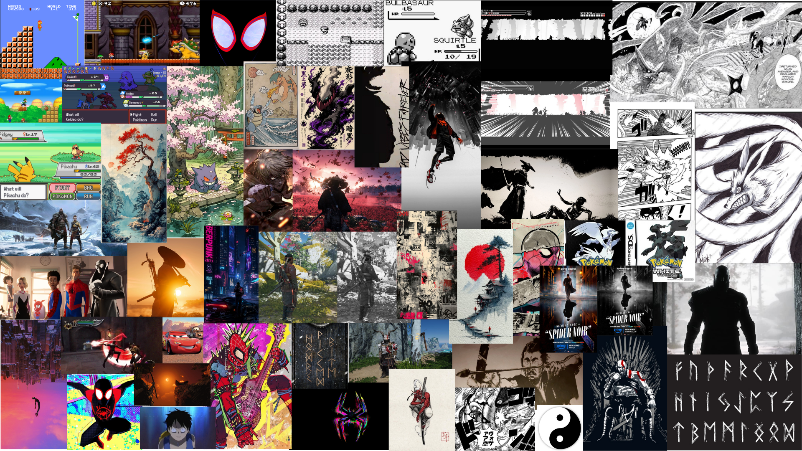
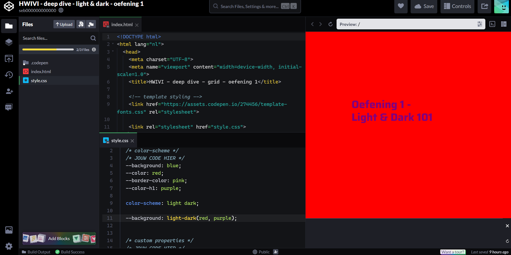
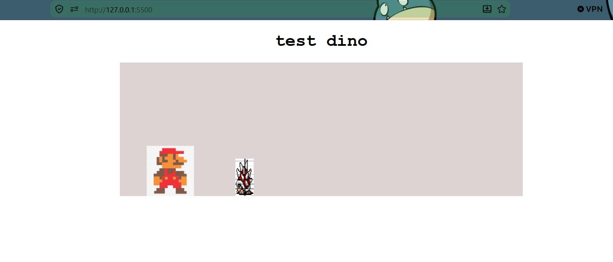

# Model

Het staat model voor digitale tuintjes welke bij 'Het web is voor iedereen' door studenten worden gemaakt.

## Learning Log

### 10 sept - [ weinig tijd door werk]

5 telefoon schetsen maken ging eigenlijk best goed want tijdens het telefoon schetsen heb ik een nieuwe manier bedacht om het te displayen, fotos:   nummer 5 is op dit moment mijn favoriet/hoofd idee.

als uitleg op nr5 je ziet spiderman over de stad kijken naar de pokemon battle, of je ziet een ronin uitkijken over de battle, als je op spiderman of de ronin klikt krijg je dialog opties en als je op de battle klikt switch het beeld naar de batttle en kan je battelen

ook bezig geweest met de deep dive over kleur  jammer genoeg vandaag door werk niet zoveel tijd als ik wil met het onderzoeken van wat mogelijk is met gradients animeren.

### 9 sept - [ presentatie ]

presentatie ging heel goed heel blij met hoe de presentatie er uiteindelijk uitziet, 8 spetember tot laat aan gewerkt maar uiteindelijk wel met een goed resultaat. ook de collage is goed gelukt 

    Wat is voor jou de essentie van wat je hebt gepresenteerd qua onderwerp en geschreven/beeldende content?

Wat er met de digitale wereld gebeurd als je kleur weghaalt

mijn doel is niet om te bepalen welke beter is, ik wil gewoon een orginele interactieve website maken en onderzoeken hoe kleur en zwart wit de zelfde digitale ervaring anders kunnen laten aanvoelen. ​

    Welke woorden uit de kwaliteitenlijst kunnen passen bij je onderwerp?​

chill, relaxt, iets op een andere manier bekijken, creatief, kleurrijk, rebels

    Heeft 'de ander' een aanvulling op je onderwerp?​

niet echt ze vond het een leuk idee en was benieuwd hoe het zou worden

    Wat is het karakter/ de uitstraling/ het gevoel dat bij het onderwerp past? (bijv. stoer, hip, vrolijk, dynamisch, eenvoudig, enz.)​

een filmische uitstraling, een street vibe, los/dynamisch/vrij, rebels, tegengesteld.

    Welke inspiratie kun je uit je 25 afbeeldingen halen. Stijl, een gevoel, vorm, enz.​

een street vibe, een warm chill gevoel, rust in chaos, oud/traditioneel stijl, futurustische stijl, ronde dynamische vormen of extreme hoekige vormen/tekens door de manga

​

Een stip op de horizon​

    Wat zou je willen vertellen over het onderwerp aan een ander? en hoe zou je dat voor je kunnen zien? middels welke beeld, tekst, animatie, inhoudelijke content? (bijv. Ik wil voornamelijk afbeeldingen tonen, als een soort Pinterest, of ik wil muziek fragmenten laten horen, of ik gebruik korte teksten met eigen foto's). ​

ik wil vooral focussen op beeld, ondersteund door passend geluid. het liefst maak ik het ook interactief

    Vul deze zin aan:

Ik wil mijn Digital Garden laten gaan over.... kleur/zwart wit en hoe je een sprong door de tijd maakt met kleur nieuw en zwartwit oud/traditioneel

en wil dat laten zien door …………………………….een ying yang te maken wat een schakelaar is waarmee je alle content aanpast.
Ik begin met een stukje eigen content over …………………….…een pokemon battle die hopelijk interactief is. ​
Als het begin is gemaakt kan ik mijn Garden verder uitbreiden door …....een scroll funtie te maken waarmee je over een stad beweegt of over bergen beweegd (afhankelijk van mode) waarin je dan ook andere dingen kan bezoeken zoals een mediterende ronin of een spiderman die door de stad slingert

    Leg uit waar het Visual Research in 3 stappen naartoe werkt

eerst heb je de directe vertaling dus wat je zelf op het oog hebt en waar je wat mee wilt doen

dan de abstracte vertaling, tussen posters kijken wat niet precies is wat je zoekt maar waarin je zoekt naar elementen die je aanspreken

en dan als 3e schets maak je schetsen van de ideeen die je hebt opgedaan

ik denk wel dat ik er wat aan heb gehad maar heb nog niet echt een concreet idee maar ik moet waarschijnlijk de info van vandaag laten bezinken en dan kijken wat mij aanspreekt voor de website.

    Vertel in 2 zinnen waar jouw Garden over gaat, en met welke content je dat gaat doen (beeld, tekst, sound, animatie enz).

mijn garden gaat over het verschil tussen een zwart witte digitale wereld en een gekleurde wereld dat ga ik doen door middel van beeld en hopelijk muziek als ondersteuning.
Vertel kort welk idee van de Crazy 8 je het liefst zou willen uitvoeren/ verder zou willen onderzoeken
het idee van de bergen en de stad die switchen lijkt mij het coolst maar ook moeilijk in css

vandaag ook in miro gewerkt wat ik wel een leuke manier van leskrijgen vond

### 8 sept - [ presentatie voorbereiden en light dark mode les]

eerst les van vassilis, heeft mij heel erg geholpen met het uitleggen wat er allemaal mogelijk is met light en dark mode en valideert mijn idee dus dat is heel fijn, ook heeft hij mij geholpen met hoe je de presentatie opend want dat lukte eerst maar niet maar moest blijkbaar in browser tekst aanpassen, hebben voor de rest ook geleerd hoe je light en dark mode kan aanmaken en ook geleerd dat je images er ook responsive naar kan maken. 

word bestand aangemaakt met allemaal plaatjes en links en bedenken wat ik precies wil doen, ik dacht wel aan een zwart wit modus maar kon voor de rest niet echt een goed onderwerp/overlappend idee vinden, ik heb uiteindelijk bedacht om het mario idee te laten vallen en voledig te focussen op de zwart wit modus aangezien dat is wat veel van de intresses gemeen hebben dus wil ik laten zien hoe de online wereld in zwart wit verandert en wat je kan doen om het aantrekkelijk te houden.

onderwerpen:

- spiderverse + spider noir, zwart wit
- pokemon begon ooit in zwart wit en heeft een black and white game
- ghost of tsushima heeft een kurosawa mode waarin je de game in zwart wit speelt als in een jaren 50 samurai modus van de director kurosawa
- god of war krijgt na dat je de game 1 keer hebt uitgespeeld een new game+ modus waarin je de game nog een keer in zwart wit kan spelen voor een andere look
- anime is in kleur en manga is in zwart wit
- jing en jang als symbool om naar zwart wit modus te switchen
- waterverf japanse zwart witte bergen met rode maan

nu bezig met presentatie html uitvinden

met heel veel geklooi uiteindelijk gelukt om afbeeldingen er in te krijgen en om ze goed te centreren, ik weet niet of het op de goede manier gebeurd is maar is denk ik ok.

### 7 sept - [ les]

- in de les tekst gelezen over wat een digital garden is

zelf heb ik "A brief history en ethos of the digital garden" gelezen

het ging over 6 basis principes van de digital garden

1 typografie en tyme lines,
wat gaat over dat de publishing dates niet uitmaken en je alles kan doen wat en wanneer je wilt

2 continues growth '
het is altijd in beweging en houd je niet tegen om wat dingen te proberen en forceerd je niet om het gelijk goed te doen '
'
3 imperfection en learning in public
het is puur voor je zelf en hoeft niemand ergens van te overtuigen waardoor het eerlijk word
en mensen zien je progressie waardoor het persoonlijker is dan als je tegen een expert praat

4 playful personal experimental
het is puur van jou en je kan er mee doen wat je wilt, zolang je experimenteerd met html css heb je alle vrijheid die je wilt

5 intercropping and content diversity
de content is van audio to film tot blogs tot boeken tijdschriften van alles waardoor het divers en persoonlijk is

6 independend ownership
het is echt van jou in tegenstelling tot dingen zoals insta

wat wilt de schrijver van mij en wat is een digital garden?

waar komen we samen op uit:
de datum waarop je het post maakt niet uit, het is altijd in beweging, het hoeft niet goed te zijn, het is persoonlijk, je kan het aanpassen het is echt van jou en doet ermee wat jij wilt.

- erna websites gerieviewed
  websites : prin.lu en church basement.org
  niet beste sites maar laat wel zien wat mijn site wel moet hebben

beste site d00k.net

slechste site vit.baisa.cz

check out:
Leg uit wat een digital garden is en waarom dat anders is dan een reguliere website.

de datum waarop je het post maakt niet uit, het is altijd in beweging, het hoeft niet goed te zijn, het is persoonlijk, je kan het aanpassen het is echt van jou en doet ermee wat jij wilt.

Leg uit wat een website 'webby' maakt en welke websites jou het meeste inspireren.

sixey.es een site die casper bezocht en was heel gepersonaliseerd met leuke interactie dus die inspireerd mij het meest.

wat een site webby maakt is fluide, interactie,toegankelijkheid, volwassen, expressie en verrassing.

Vertel waar jij mee aan de slag wilt gaan bij het maken van jouw eigen digital garden (let op: dit zijn jouw eerste ideeën, dit kan en mag veranderen in de loop van het programma.

een site maken met dingen die ik cool vind

hoofd idee: een site maken met verschillende games zoals mario en pokemon, een animatie toevoegen en met de light en dark mode alles in een zwart witte manga stijl kan veranderen

andere intresses voor de site maar nog zonder concreet idee:

- mythologie (grieks en noors)
- anime/manga
- games (retro)
- spiderverse style
- japan. oude tempels maar ook nieuwe cyberpunk style
- gitaar spiderpunk style

en aangezien mijn site sebbb heet misschien iets doen met bbb inplaats van AAA wat gebruikt word om goede kwaliteit games aan te geven

### 6 sept - [learning log bijgewerkt]

### 4 sept - [deep dive html/css en schetsen]

in de html/css basis les veel geleerd over wat voor dingen je wel en niet moet gebruiken zoals divs en spans en basis opgefrist.

ook achter gekomen dat java script het liefst zo min mogelijk gebruikt word dus dat ik een manier moet vinden om de mario dino game in css te maken.

als vragen had ik in de les wat atom was en of we dat moesten gebruiken aangezien we al vs codium gebruiken en atom dan overbodig leek. en dat klopte, atom is gewoon een ander programma wat je mag gebruiken als je wilt.

foto aantekeningen css in file 
schets les was ook leuk eerst oude schetsen geranked en gekeken naar wat een schets goed maakt, duidelijkheid, annotaties, lettertype schaduw en nog wat andere dingen. erna moesten we een site na schetsen wat ik wel een hele opdracht vond en wel goed was gelukt en leerden we hoe we een animatie konden laten zien in de schets door blauwe stippel lijnen. 

eind van de dag heeft laura mij nog geholpen om het digitale tuintje goed werkend te krijgen en nu zou alles het moeten doen

### 3 sept - [ziek thuis]

wel geprobeerd thuis powerpoint te volgen van nicky, begreep het allemaal wel goed want was vooral herhaling van experimenteren met interactie.

- toen idee van mario game geprobeerd begin uit te werken door toen thuis nog een youtube tutorial te volgen over hoe je de chrome dino game moet maken, en zelf wat dingen aangepast om het richting mijn idee van mario te veranderen. https://www.youtube.com/watch?v=lgck-txzp9o 

- idee: miss iets met pokemon turn based battle ofzo maken als site

### 2 sept - [ziek thuis inplaats van workshop]

ziek thuis, maar probeer thuis verder te komen, denk dat ik vscodium heb gekoppeld aan site maar denk dat ik iets fout heb gedaan want veranderingen worden niet door gevoerd.

aangezien er 2 versies moeten (bijv licht en dark) denk ik wellicht 1 normale modus en een manga style zwart wit modus

### 1 sept - [thuis]

idee: site over mijn creatieve inspiraties/intresses maken zodat ik veel dingen die ik cool vind kan combineren in mijn site

- mythologie
- anime/manga
- games (retro)
- spiderverse style
- japan. oude tempels maar ook nieuwe cyberpunk style

### 31 aug - Kickoff

Een fork van de model repository gemaakt en gepubliceerd via mijn eigen Github omgeving.

Leg uit wat een source hosting platform is en voor welke jij gekozen hebt.

een programma die websites host, github want die stond al geinstalleerd.

Vertel welke domeinnaam jij gekozen hebt en hoe je die hebt gekoppeld aan jouw pagina.

sebbb mijn naam met extra letters, gekoppeld volgens stappeplan.

Beschrijf hoe je aanpassingen aan jouw pagina kunt maken en hoe je er voor zorgt dat die op het web gepubliceerd worden.

weet ik niet is nog niet gelukt.
